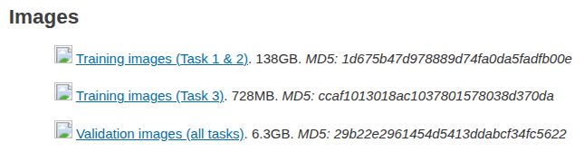

## Spectrum Matching

Official PyTorch implementation of our paper: [Spectrum Matching: a Unified Perspective for
Superior Diffusability in Latent Diffusion](https://arxiv.org/abs/2603.14645)

The repository is based on [Latent Diffusion](https://github.com/priyammaz/PyTorch-Adventures/tree/main/PyTorch%20for%20Generation/Diffusion/Latent%20Diffusion) which is a re-implementation of SD-VAE.

<p align="left">
  
</p>


## Installation


```bash
conda create -n VAE python==3.9.13
conda activate VAE
pip install -r requirements.txt
```


## Data Preparation

**CelebA 256x256**: download the dataset from [kaggle](https://www.kaggle.com/datasets/badasstechie/celebahq-resized-256x256), which will be a single image folder

**ImageNet 256x256** 
1. Download the 128,1167 training images and 50,000 val images from [official web](https://www.image-net.org/challenges/LSVRC/2012/2012-downloads.php) 

<p align="left">
  
</p>


2. Create a `train` folder and a `val` folder, unzip the tar files into the folders: 
```bash
mkdir train
mkdir val
tar xvf ILSVRC2012_img_train.tar -C ./train
tar xvf ILSVRC2012_img_val.tar -C ./val
```

3. After unzipping the `train_tar` file, you will get 1000 tar files in `train` folder.
Copy the commands below into a shell file, then run the shell file to further unzip

```bash
dir=./train
for x in $dir/*tar; do
filename=$(basename $x .tar)
mkdir $dir/$filename
tar -xvf $x -C $dir/$filename
done
rm $dir/*.tar
```

4. resize all images in `train` and `val` folders to 256x256 by running the script [utils.py](utils.py)

```python
center_crop_imagenet_val_mp(root_dir='/imagenet256/val', image_size=256)
center_crop_imagenet_train_mp(root_dir='/imagenet256/train', image_size=256)
```


## Train SD-VAE, ESM-AE on CelebA
checkout to the branch [SDVAE_and_ESM](https://github.com/forever208/SpectrumMatching/tree/SDVAE_and_ESM)

we use 4 A100 GPUs to train VAE on CelebA 256x256 (feel free to use f8d4 or f16d16)

```shell
accelerate launch --multi_gpu --num_machines 1 --num_processes 4 --num_cpu_threads_per_process 8 \
--mixed_precision bf16 LDM/vae_trainer.py \
--working_directory LDM/YOUR_EXP_NAME \
--eval_dir LDM/YOUR_EXP_NAME \
--log_wandb --experiment_name SDVAE --wandb_run_name YOUR_EXP_NAME \
--training_config LDM/configs/train_vae_celeba256.yaml \
--model_config LDM/configs/ldm_f16d16.yaml \
--dataset celeba256 --path_to_dataset PATH_TO_DATASET \
--no-log_wandb
```

in [train_vae_celeba256.yaml](configs/train_vae_celeba256.yaml)
1. setting `kl_weight=1e-6` and `esm_weight=0.0` corredponds to SD-VAE
2. setting `kl_weight=0.0`, `esm_weight=0.01` and `delta=1.0` corredponds to ESM-AE


## Train DSM-AE on CelebA

checkout to the branch [DSM](https://github.com/forever208/SpectrumMatching/tree/DSM)

we use 4 A100 GPUs to train DSM-AE on CelebA 256x256 (feel free to use f8d4 or f16d16)

```shell
accelerate launch --multi_gpu --num_machines 1 --num_processes 4 --num_cpu_threads_per_process 8 \
--mixed_precision bf16 LDM/vae_trainer.py \
--working_directory LDM/YOUR_EXP_NAME \
--eval_dir LDM/YOUR_EXP_NAME \
--log_wandb --experiment_name DSM --wandb_run_name YOUR_EXP_NAME \
--training_config LDM/configs/train_vae_celeba256.yaml \
--model_config LDM/configs/ldm_f16d16.yaml \
--dataset celeba256 --path_to_dataset PATH_TO_DATASET \
--no-log_wandb
```


## Train SD-VAE on ImageNet
checkout to the branch [SDVAE_and_ESM](https://github.com/forever208/SpectrumMatching/tree/SDVAE_and_ESM)

we use 8 A100 GPUs to train VAE on ImageNet 256x256 (we use f16d16 for efficiency reason)

```shell
accelerate launch --multi_gpu --num_machines 1 --num_processes 8 --num_cpu_threads_per_process 8 \
--mixed_precision bf16 LDM/vae_trainer.py \
--working_directory LDM/YOUR_EXP_NAME \
--eval_dir LDM/YOUR_EXP_NAME \
--log_wandb --experiment_name SDVAE --wandb_run_name YOUR_EXP_NAME \
--training_config LDM/configs/train_vae_imagenet256.yaml \
--model_config LDM/configs/ldm_f16d16.yaml \
--dataset celeba256 --path_to_dataset PATH_TO_DATASET \
--no-log_wandb
```


## Train DSM-AE on ImageNet
checkout to the branch [DSM](https://github.com/forever208/SpectrumMatching/tree/DSM)

we use 8 A100 GPUs to train VAE on ImageNet 256x256 (we use f16d16 for efficiency reason)

```shell
accelerate launch --multi_gpu --num_machines 1 --num_processes 8 --num_cpu_threads_per_process 8 \
--mixed_precision bf16 LDM/vae_trainer.py \
--working_directory LDM/YOUR_EXP_NAME \
--eval_dir LDM/YOUR_EXP_NAME \
--log_wandb --experiment_name DSM --wandb_run_name YOUR_EXP_NAME \
--training_config LDM/configs/train_vae_imagenet256.yaml \
--model_config LDM/configs/ldm_f16d16.yaml \
--dataset celeba256 --path_to_dataset PATH_TO_DATASET \
--no-log_wandb
```


## Extract VAE Latents and Diffusion Training

Using the script [extract_VAE_latents.py](extract_VAE_latents.py) to extract VAE latents of CelebA 256

```python
extract_latent(
        pretrained_weights='PATH_TO_CKPT/model.safetensors',
        config_file='/configs/ldm_f16d16.yaml', batch_size=100, dataset='celeba256',
        path_to_dataset='PATH_TO_DATASET',
        path_to_latents='PATH_TO_SAVE_LATENTS',
        num_stat_samples=50000
    )
```
we then use [U-ViT] to train the diffusion


Using the script [extract_VAE_latents.py](extract_VAE_latents.py) to extract VAE latents of ImageNet 256

```python
    # accelerate launch --num_processes 4 --mixed_precision no extract_VAE_latents.py
    get_latent_scaler(
        pretrained_weights="PATH_TO_CKPT/model.safetensors",
        config_file="/configs/ldm_f16d16.yaml", batch_size=100, dataset="imagenet_train",
        path_to_dataset="'PATH_TO/imagenet256/train", num_stat_samples=200000,
    )

    # accelerate launch --num_processes 4 --mixed_precision no extract_VAE_latents.py
    extract_latent_ddp_for_REPA(
        pretrained_weights="PATH_TO_CKPT/model.safetensors",
        config_file="configs/ldm_f16d16.yaml", batch_size=100, dataset="imagenet_train",
        path_to_dataset="PATH_TO/imagenet256/train",
        path_to_latents="PATH_TO/imagenet256_DSM/vae-sd",
        path_to_images="PATH_TO/imagenet256_DSM/images",
        num_workers=12,
        no_images=False,  # set True to skip PNG writing
        max_save_threads=8,  # cap per-rank save threads (recommend 4–16)
    )
```

 we then use [REPA] to train the diffusion